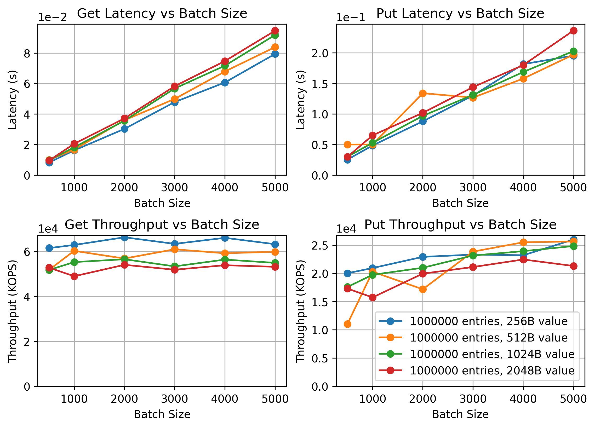

# LETUS_prototype
 


This is a prototype implementation of [LETUS: A Log-Structured Efficient Trusted Universal BlockChain Storage](https://doi.org/10.1145/3626246.3653390).

LETUS is a <u>**L**</u>og-structured <u>**E**</u>fficient <u>**T**</u>rusted <u>**U**</u>niversal <u>**S**</u>torage for blockchain, providing cryptographic tamper evidence with excellent performance and resource efficiency.
LETUS is made up of three main components: DMM-Trie, LSVPS, VDLS.
- **DMM-Trie** is a central component within the storage layer, functioning as a multi-versioned Merkle tree that provides cryptographic verification with dynamic updates and deterministic hashes.
- **LSVPS** is a log-structured, versioned, page abstraction storage subsystem used to store a large volume of pages generated by DMM-Trie.
- **VDLS** is an append-only logging stream that stores all versioned user data records.

The following figure shows the architecture of LETUS.


# Get Started
## Clone
To use LETUS_protype, developers first need to clone the main branch as their project directory.
```
$ git clone https://github.com/hongliangjie/LETUS_prototype.git
$ cd LETUS_prototype
```
The project directory should look like this:
```
.
├── LICENSE
├── build.sh                // bash script to build the project
├── run.sh                  // bash script to run a simple test
├── CMakeLists.txt          // CMake file to build the project
├── exps                    // experiment directory
│   ├── micro_benchmark.sh          // bash script to start the micro-benchmark experiment
│   ├── plot_micro_benchmark.py     // python script plot the result of micro-benchmark
│   ├── run_micro_benmark.sh        // bash script to run the micro-benchmark and plot
│   ├── range_benchmark.sh          // bash script to start the range-benchmark experiment
│   ├── plot_range_benchmark.py     // python script plot the result of range-benchmark
│   ├── run_range_benchmark.sh      // bash script to run the range-benchmark and plot
│   └── ...                         // other experiment scripts
├── lib
|   ├── LSVPS.hpp           // LSVPS header file
│   ├── DMMTrie.hpp         // DMMTrie header file
│   ├── VDLS.hpp            // VDLS header and impelemtation
│   ├── common.hpp          // some commonly used data structures
│   └── Letus.h             // LETUS interface for C (to be used in go-wrapper)
├── src
|   ├── LSVPS.cpp           // LSVPS implementation
│   ├── DMMTrie.cpp         // DMMTrie implementation
│   └── Letus.cpp           // LETUS interface implementation
├── workload
|   ├── exes                    // all the main function for evaluation
|   |   ├── microBenchmark.cc   // implement the micro-benchmark experiment
|   |   ├── rangeBenchmark.cc   // implement the range-benchmark experiment
|   |   └──...                  // other workloads
│   └── lib/                // utility functions for workload generator
├── gowrapper               // go wrapper for LETUS
│   ├── go-build.sh         // bash script to build the go-wrapper
│   ├── go-run.sh           // bash script to build the go-wrapper and test it with a simple test
│   ├── letus/              // implementation of the go-wrapper
│   ├── db-interface.md     // go database interface description
│   ├── test_letus_lib.c    // a simple test for the C interface
│   └── main.go             // a simple test for the go-wrapper
└── README.md               // this file

```

## Dependencies
Developers are required to install the following dependencies:
* [CMake](https://cmake.org/) >= 3.12 or 
* C++ compiler with C++17 support (e.g., g++ >= 11.1 or clang++ >= 8.0)
* [Go](https://golang.org/) >= 1.21
* [OpenSSL](https://www.openssl.org/) >= 1.1

## Build
### build for release
```
$ cd LETUS_prototype/
$ ./build.sh --build-type release --cxx g++
```
### build for debug
```
$ ./build.sh --build-type release --cxx g++
```

### Build with go-wrapper
To integrate LETUS into hyperchain, we implement a go-wrapper for LETUS.
The go-wrapper is tested in `gowrapper/main.go`.
To build the go-wrapper, developers just run the following command.
```
$ cd gowrapper
$ go mod init letus
$ ./go-build.sh
```

#### use Docker container
Build a docker image with the following command.
```
$ docker build -t letus-go .
```
Run a docker container
```
$ docker run -it -v ${PWD}:/home -w /home letus-go /bin/bash
```
# Run
We provde serveral workloads to test the performance of LETUS.

## workloads from the paper
### simple payment
### micro-benchmark
### stand-alone

## micro-benchmark
Micro-benchmark first load the data into LETUS, the data volume is specified by `entry_count`.
The key size and value size of each entry is specified by `key_size` and `value_size`.
Then it randomly updates the data in batch, and collect the latency and throughput of each update.
The batch size is specfied by `batch_size`.
Then it randomly reads the data in batch, and collect the latency and throughput of each read.

To run the micro-benchmark, execute the following command.
```
$ cd exps/
$./run_micro_benchmark.sh
```
A figure shows the result of micro-benchmark can be found in `exps/result_letus/micro_benchmark_summary.png`.
The following result is abtained with `entry_count=1000000`, `key_size=64`, `value_size=256B, 512B, 1024B, 2048B`, `batch_size=500~5000`.



## range-benchmark
Range-benchmark first load the data into LETUS, the data volume is specified by `entry_count`.
The key size and value size of each entry is specified by `key_size` and `value_size`.
A list of range size is given, for example `[5, 50, 100, 200, 300, 400, 500, 1000, 2000]`.
For each range size `r`, it randomly chose a start key `k`, and query LETUS of all the key in the range ``[k, k+r)``.
Then it collects the latency and throughput of each query.
To run the range-benchmark, execute the following command.
```
$ cd exps/
$./run_range_benchmark.sh
```
A figure shows the result of range-benchmark can be found in `exps/result_letus/range_benchmark_summary.png`.
The following result is obtained with `entry_count=1M/10M`, `key_size=64`, `value_size=1024B`.


# Citation
